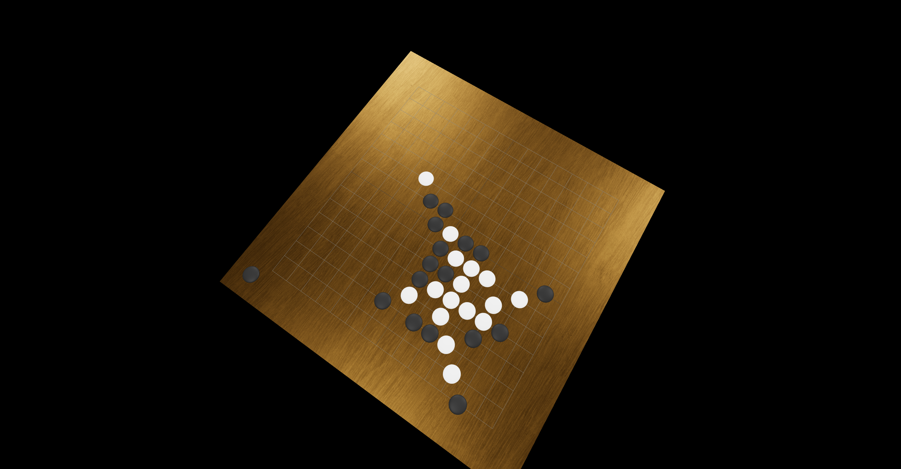

# 🎲 Gomoku 3D: A React Three Fiber Gomoku Game

This project is an exciting and visually stunning implementation of the classic Gomoku game using React Three Fiber.

## 🌟 Features

3D graphics powered by Three.js and React Three Fiber

## 🎓 How to Play

Gomoku, also known as Five in a Row, is a two-player strategy game played on a grid.\
Players take turns placing their pieces on the board, attempting to form an unbroken line of five of their own pieces either horizontally, vertically, or diagonally.\
The first player to achieve this wins the game!

## 📖 Rules

Black always goes first.\
Players alternate turns, placing one piece on an empty intersection.

## 📄 License

It is released under the MIT License.

## 😄 Final Words

Enjoy playing Gomoku 3D! If you encounter any issues or have feedback, feel free to open an issue or submit a pull request. Happy gaming!
